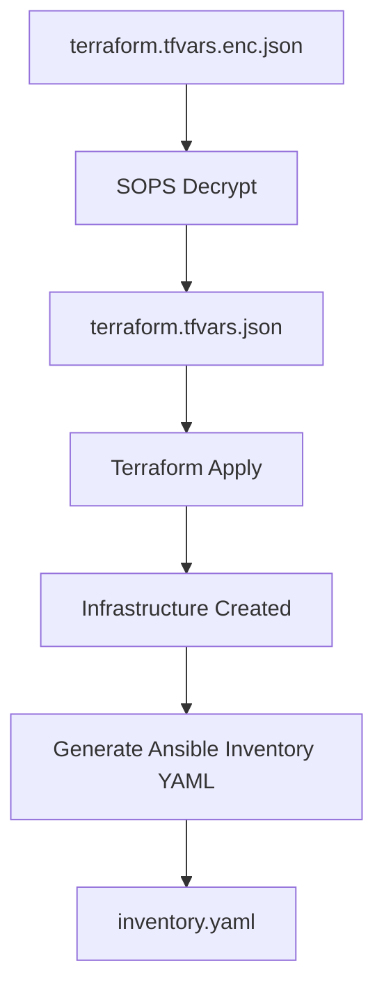

# stuttgart-things/blueprints/vm

## 📊 Diagram: VM Provisioning Flow



## FUNCTIONS

<details><summary>BAKE LOCAL</summary>

```bash
# JUST RUN ANSIBLE w/o src, inventory file or requirements file
dagger call -m vm execute-ansible \
--playbooks "sthings.baseos.setup" \
--hosts "10.31.103.58" \
--ssh-user=env:SSH_USER \
--ssh-password=env:SSH_PASSWORD \
--progress plain -vv
```

</details>


## WORKFLOWS

<details><summary>BAKE LOCAL</summary>

```bash
# TERRAFORM SECRETS SOPS ENCRYPTED
export SSH_USER=sthings
export SSH_PASSWORD=<REPLACEME>

dagger call -m vm bake-local \
--terraform-dir ~/projects/terraform/vms/sthings-runner/ \
--encrypted-file /home/sthings/projects/stuttgart-things/terraform/secrets/labda-terraform.tfvars.enc.json \
--operation apply \
--sops-key=env:SOPS_AGE_KEY \
--ansible-requirements-file tests/vm/requirements.yaml \
--ansible-user=env:SSH_USER \
--ansible-password=env:SSH_PASSWORD \
--ansible-parameters "send_to_homerun=false" \
--ansible-playbooks "sthings.baseos.setup" \
-vv --progress plain \
export --path=~/projects/terraform/vms/sthings-runner/
```

```bash
# TERRAFORM SECRETS FROM VAULT
export SSH_USER=sthings
export SSH_PASSWORD=<REPLACEME>

dagger call -m vm bake-local \
--terraform-dir ~/projects/terraform/vms/sthings-runner \
--vault-secret-id env:VAULT_SECRET_ID \
--vault-role-id env:VAULT_ROLE_ID \
--variables "vault_addr=https://vault-vsphere.tiab.labda.sva.de:8200" \
--ansible-requirements-file tests/vm/requirements.yaml \
--ansible-playbooks "sthings.baseos.setup" \
--ansible-user=env:ANSIBLE_USER \
--ansible-password=env:ANSIBLE_PASSWORD \
--ansible-wait-timeout=90 \
--ansibleParameters="send_to_homerun=false" \
--progress plain -vv \
export --path=~/projects/terraform/vms/sthings-runner/
```

```bash
dagger call -m vm bake \
--terraform-dir ~/projects/terraform/vms/sthings-runner/ \
--encrypted-file /home/sthings/projects/stuttgart-things/terraform/secrets/labda-terraform.tfvars.enc.json \
--operation apply \
--sops-key=env:SOPS_AGE_KEY \
--ansible-user=env:SSH_USER \
--ansible-password=env:SSH_PASSWORD \
--ansible-parameters "send_to_homerun=false" \
--ansible-playbooks "sthings.baseos.setup" \
-vv --progress plain \
export --path=~/projects/terraform/vms/sthings-runner/
```

</details>

<details><summary>BAKE LOCAL BY PROFILE</summary>

```bash
cat <<EOF >> vm.yaml
---
operation: apply
variables:
  - vault_addr=https://vault-vsphere.tiab.labda.sva.de:8200
ansiblePlaybooks:
  - "sthings.baseos.setup"
ansibleParameters: []
ansibleInventoryType: default
ansibleWaitTimeout: 30
ansibleRequirementsFile: ./requirements.yaml
encryptedFile: ""
EOF
```

```bash
dagger call -m vm bake-local-by-profile \
--src ./ \
--profile vm.yaml \
--vault-secret-id env:VAULT_SECRET_ID \
--vault-role-id env:VAULT_ROLE_ID \
--ansible-user env:ANSIBLE_USER \
--ansible-password env:ANSIBLE_PASSWORD \
--progress plain -vv \
export --path ./
```


</details>


<details><summary>DESTROY</summary>

```bash
dagger call -m vm bake-local \
--operation destroy
--terraform-dir ~/projects/terraform/vms/sthings-runner/ \
--vault-secret-id env:VAULT_SECRET_ID \
--vault-role-id env:VAULT_ROLE_ID \
--variables "vault_addr=https://vault-vsphere.example.com:8200" \
--ansible-requirements-file tests/vm/requirements.yaml \
--ansible-playbooks "sthings.baseos.setup" \
--ansible-user=env:ANSIBLE_USER \
--ansible-password=env:ANSIBLE_PASSWORD \
--progress plain -vv \
```

</details>


## FUNCTIONS

<details><summary>DECRYPT FILE w/ SOPS</summary>

```bash
dagger call -m vm \
decrypt-sops \
--sops-key=env:SOPS_AGE_KEY \
--encrypted-file tests/vm/terraform.tfvars.enc.json
```

</details>

<details><summary>EXECUTE TERRAFORM</summary>

```bash
# APPLY
dagger call -m vm \
execute-terraform \
--terraform-dir tests/vmtemplate/tftest \
--operation apply \
--vault-secret-id env:VAULT_SECRET_ID \
--vault-role-id env:VAULT_ROLE_ID \
--variables "vault_addr=https://vault-vsphere.example.com:8200" \
--progress plain -vv \
export --path=/tmp/dagger/tests/terraform/
```

```bash
# DESTROY
dagger call -m vm \
execute-terraform \
--terraform-dir /tmp/dagger/tests/terraform/ \
--operation destroy \
--vault-secret-id env:VAULT_SECRET_ID \
--vault-role-id env:VAULT_ROLE_ID \
--variables "vault_addr=https://vault-example.com:8200" \
--progress plain -vv
```

</details>

<details><summary>OUTPUT TERRAFORM RUN</summary>

```bash
dagger call -m vm \
output-terraform-run \
--terraform-dir=~/tmp/dagger/tests/terraform/ \
--progress plain -vv \
```

</details>

<details><summary>RUN ANSIBLE</summary>

```bash
dagger call -m vm \
execute-ansible \
--src . \
--playbooks tests/vm/ansible/vault-test.yaml \
--requirements tests/vm/ansible/requirements.yaml \
--inventory tests/vm/ansible/inventory \
--vaultAppRoleID env:VAULT_ROLE_ID \
--vaultSecretID env:VAULT_SECRET_ID \
--vaultURL env:VAULT_ADDR \
-vv --progress plain

```

</details>

<details><summary>GET TSHIRT SIZE</summary>

```bash
dagger call -m vm tshirt-size \
--config-file=tests/vm/config/vm-tshirt-sizes.yaml \
--size=medium \
-vv --progress plain
```

</details>
